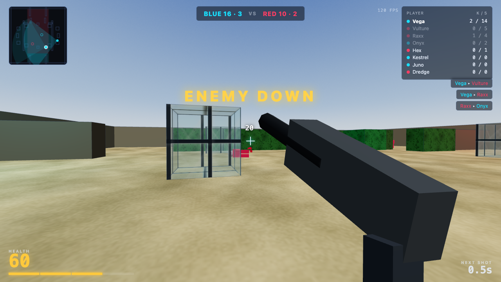

# Neon Bastion



**▶ Play it: <https://leoli-dev.github.io/neon-bastion/>** — desktop browser, click **Deploy**, mouse to aim.

Neon Bastion is a self-contained, browser-based 4v4 arena FPS built with TypeScript, Vite, and Three.js. One human player and three AI teammates face four AI opponents in a symmetric procedural arena. There is no backend, CDN, external model, or downloaded game asset: gameplay, rendering, AI, map, and Web Audio are all local.

> **How this repository was written.** Every line of application code and every test in this
> repository was written by **Qwen3.8-27B-8bit**, an open-weights model running locally on a
> laptop through `mlx-dspark` with DFlash2 speculative decoding, driving the `pi` CLI coding
> agent. A human played the game and set the requirements; a reviewer decomposed those into
> tasks and verified each commit. The model did the implementation. **[REPORT.md](REPORT.md)**
> is the full write-up: what it did well, where it failed, every problem hit along the way, and
> what the same token volume would have cost on a commercial API.

## Quick start

Requires Node.js 20 or newer.

```bash
npm install
npm run dev
```

Open the URL Vite prints (normally `http://localhost:5173`). For a production build:

```bash
npm run build
npm run preview
```

## Controls

| Input | Action |
| --- | --- |
| `WASD` or arrow keys | Move |
| Mouse | Aim after pointer lock |
| Left click | Fire pulse rifle |
| `Shift` | Sprint |
| `Space` | Jump |
| `Q` / `E` | Previous / next ally while spectating |
| `Esc` | Release pointer lock and pause |
| `F2` | Toggle director mode |
| `F3` or `` ` `` | Toggle debug panel |
| `M` | Toggle background music |

Click **Deploy** to begin; it also requests the pointer lock required for mouse aiming.

## Features

- Fixed 60 Hz deterministic match simulation, seeded RNG, dodgeable ballistic projectiles (60 u/s, so a shot takes 0.17-0.5 s to cross a typical engagement), scorekeeping, and team-elimination rounds.
- Eight-unit match: Vega plus three AI teammates against four opponents. AI uses a navmesh, line-of-sight/hearing, pathfinding, combat positioning, and spectating handoff.
- Three.js arena with procedural sky, terrain, glass and hedge wall materials, unit animation, third- and first-person weapons, tracers, muzzle flashes, sparks, minimap, and HUD feedback.
- Synthesized Web Audio effects and a 150 BPM combat music loop; no audio assets are fetched.
- Accessibility and resilience: `prefers-reduced-motion` support and a live 2D fallback when WebGL is unavailable (or with `?nogl=1`).

## Project layout

```text
src/
  app.ts             Application lifecycle, input, fixed-tick loop, and screens
  game/              Match simulation, AI, combat, map, movement, audio, and types
  render/            Three.js scene, HUD, effects, animation, and weapons
  testHooks.ts       Deterministic browser API used by E2E tests
tests/
  unit/              Simulation and rendering-unit tests
  e2e/               Playwright browser tests
screenshots/         Visual evidence emitted by the E2E suite
docs/hero.png        Screenshot used at the top of this file
REPORT.md            How this repository was written, and what it cost
```

## Quality checks

```bash
npm run typecheck   # TypeScript only
npm test            # Vitest unit suite
npm run test:e2e    # Playwright browser suite
npm run test:all    # Both suites
npm run build       # Typecheck and production bundle
```

At the current revision, the suite contains 149 unit tests and 26 Playwright scenarios. The E2E suite intentionally regenerates the tracked screenshots in `screenshots/`; run it when you want refreshed visual evidence, and include those updates in a feature commit only when the rendered result intentionally changed.

## Notes

- Headless Chromium generally declines pointer lock. The browser suite verifies that it is requested and uses deterministic test hooks for aim and simulation control.
- The production JavaScript bundle is about 636 kB before gzip (about 169 kB gzip), principally because Three.js is loaded with the renderer.
- The AI is designed for clear, fair matches rather than competitive play against an expert human.
