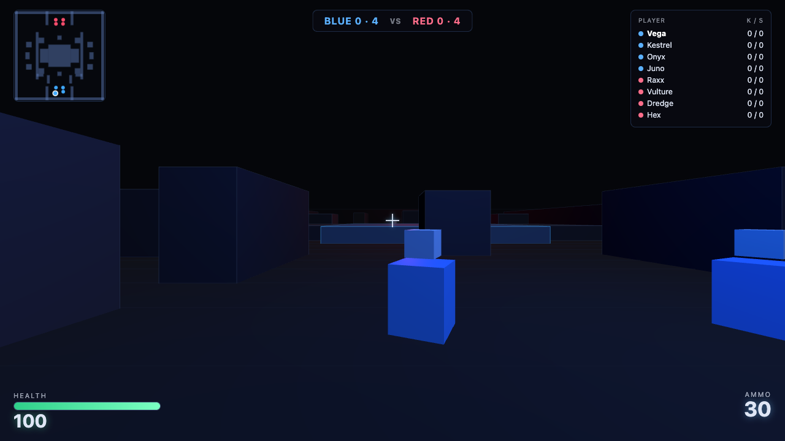
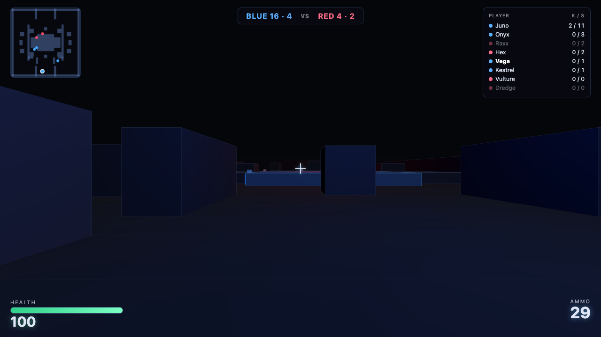
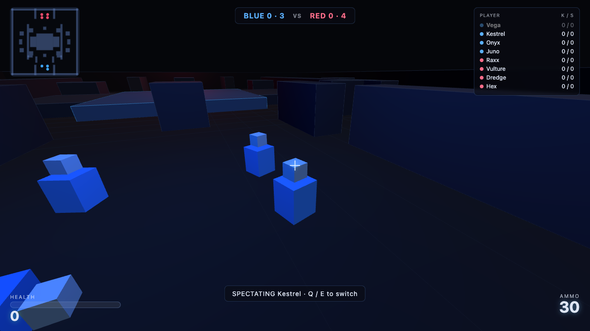
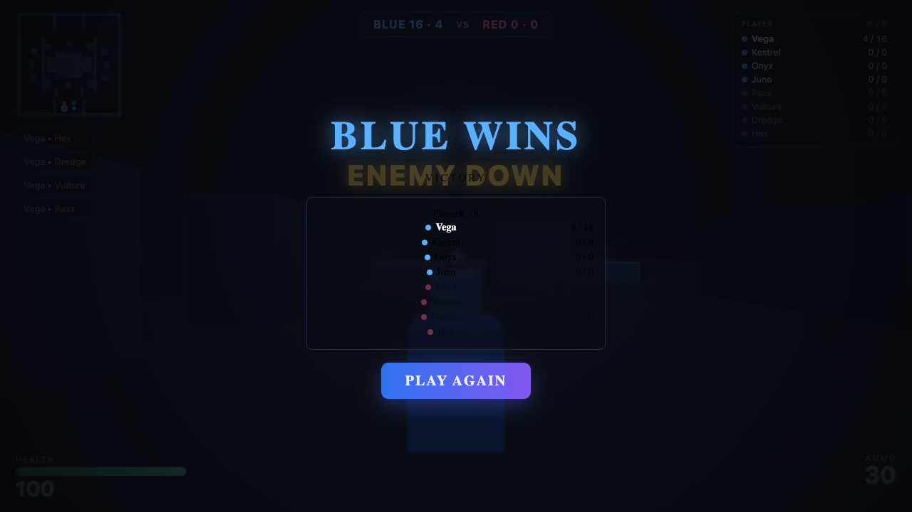

# Neon Bastion

A complete, playable **4v4 first-person arena team-deathmatch** that runs entirely
in the browser. No backend, no network, no external assets — every model, texture,
sound, and the map itself is generated procedurally. You play one blue soldier
against 3 AI allies, on the opposite side 4 AI red soldiers fight back.



| | |
|---|---|
| | |
| **Combat** | **Spectating** |
|  |  |
| **Results / restart** | **Controls** |
|  | **Move** `W A S D` &nbsp;·&nbsp; **Aim** Mouse |
| | **Shoot** L-click &nbsp;·&nbsp; **Sprint** `Shift` &nbsp;·&nbsp; **Reload** `R` |
| | **Spectate** `Q` / `E` &nbsp;·&nbsp; **Pause** `Esc` |

---

## Quick start

```bash
npm install

npm run dev          # Vite dev server (http://localhost:5173)
npm run build        # typecheck + production bundle into dist/
npm run preview      # serve the production build (http://localhost:4173)

npm test             # unit tests (Vitest, 31 tests)
npm run test:e2e     # Playwright E2E (5 scenarios, 4 screenshots)
npm run test:all     # both of the above
```

Open the dev/preview URL and **click to deploy**. The game requires a modern
browser with WebGL.

---

## Feature summary

- **Full match lifecycle** — start screen → deploy → combat → death/spectate →
  win/lose → results → restart (complete state reset).
- **Hitscan combat** with true **wall occlusion** (a bullet stops at the first
  solid it hits). Head hits deal 50, body 20. **No friendly fire.**
- **Scoring** — +1 per valid hit, +3 for the killing blow (a killing shot is
  worth +4). No double counting.
- **Procedural AI** for the 7 non-player soldiers: a 7-state behaviour machine
  (`assemble → patrol → engage → retreat → search → cautious → dead`) with fair,
  limited senses (100° FOV, distance caps, line-of-sight), nav-graph
  pathfinding (A*), reaction delays, and bounded inaccuracy — beatable, not
  wall-hugging, and never able to shoot through walls.
- **Low-poly 3D arena** — one central raised platform with ramps, two flanking
  wings, cover crates, and mirrored mazes. Built from a single data file.
- **Death → spectator** — on death you cycle through living allies with `Q` /
  `E`; if your whole team is down you get a free orbiting camera.
- **WebAudio SFX** — every sound (gunfire, hitmarkers, kills, reloads, end
  jingle) is synthesized at runtime. Audio is gated behind the first user
  gesture.
- **HUD** — crosshair, health, ammo, team totals, live leaderboard, killfeed,
  spectator bar, minimap, FPS counter, and start / pause / results screens.
- **Deterministic** — seeded RNG, a fixed 60 Hz logic tick decoupled from the
  render loop, and no wall-clock dependency in game logic. Same seed ⇒ same game.

---

## Architecture

The whole game is ~3,400 lines of TypeScript. The logic is **framework-free and
pure** where it matters (it runs headlessly in the unit tests), and only the
render/UI layer touches the DOM or Three.js.

```
src/
  main.ts               # bootstrap: createApp()
  app.ts                # owns Match + Renderer + HUD + Audio; fixed-tick loop,
                        #   input, pointer-lock/pause lifecycle
  testHooks.ts          # window.__teamArenaTest (read state, seed, teleport,
                        #   shoot, fast-forward, force-spectate, restart)

  game/
    types.ts            # all shared types (Unit, Solid, MapData, …)
    rng.ts              # seeded RNG (mulberry32 + hash) — the determinism root
    constants.ts        # CONFIG: movement, weapon, AI tuning, damage, scoring
    match.ts            # Match: owns all units + clock; tick(), controlPlayer,
                        #   AI think, spectate, checkEnd, events, snapshot()
    audio.ts            # WebAudio synth (no assets)

    map/
      mapData.ts        # THE map: 29 solids, 8 spawns, 33 nav nodes (one source)
      geometry.ts       # ray-AABB / ray-sphere, groundHeight, LOS, walkability
      movement.ts       # moveCharacter (pure) + stepUnit; collision, ramps, gravity
      navmesh.ts        # build nav graph from map, A* pathfinding

    units/
      units.ts          # createUnit, body/head hitboxes, name helpers

    combat/
      weapon.ts         # spread cone, reload, heat/recoil, fire gating
      hitscan.ts        # resolveShot (wall-vs-target priority), fireWeapon

    ai/
      aiPerception.ts   # canSee (FOV + LOS + distance), isHeard, perceive
      aiController.ts   # createBrain + aiThink: the 7-state behaviour machine
      spectator.ts      # resolveSpectator (pure: ally cycling / free-cam)

  render/
    renderer.ts         # Three.js scene: arena, 8 unit visuals, tracers, sparks,
                        #   FPV/chase/free-cam camera, 2D minimap
    hud.ts              # DOM HUD: crosshair, bars, leaderboard, killfeed, screens
```

### The map is the single source of truth

`mapData.ts` is the only place geometry is defined. The **same list of axis-
aligned solids** drives everything:

- horizontal collision and step-up (a body can't climb more than `maxStep`),
- ground height (a box's top / a ramp's slope is the floor beneath you),
- **bullet occlusion** (a ray that hits a solid stops there),
- the minimap.

Cover and walls differ only by height; both block fire at eye level. Navigation
edges are derived from the nav nodes at build time using distance + line-of-
sight, so **an AI path can never cross a wall** — the same geometry that blocks
bullets blocks movement.

### Fixed-tick determinism

`Match.tick(dt)` advances the simulation by a fixed step (the app feeds it at
60 Hz from an accumulator). Every random draw flows from a seeded RNG, and each
bullet's inaccuracy is derived from `seed + shotIndex` (independent of other
draws). AI units keep their own per-unit RNG. The render loop reads the state
each frame but never mutates it, so **rendering never affects the simulation**.
`Match.snapshot()` returns a plain, serialisable state object — the same shape
the E2E tests and the test hooks read.

### The AI

Each AI unit runs a brain (a small state machine) in `aiController.ts`:

- **assemble / patrol** — hold a lane and wait to engage;
- **engage** — pick the best visible target, close to a firing range, strafe,
  aim (with inaccuracy + reaction delay) and fire in bursts;
- **retreat** — when HP drops below a threshold, seek cover and disengage;
- **search / cautious** — lost the target? path to last-seen and sweep;
- **dead** — stop.

Senses are deliberately limited and fair: a 100° FOV cone, a vision distance cap,
and a line-of-sight check against the same solids that block bullets — so the AI
**cannot shoot through walls** and only reacts to what it can actually see or
hear. Accuracy and reaction time are configurable in `CONFIG.ai`.

### Scoring (no double counting)

A single shot resolves once: it picks the **nearest** of (first wall hit, first
enemy hit). If it's a wall, no damage. If it's an enemy, that target takes the
damage (head 50 / body 20) — same-team units are ignored entirely (no FF). The
shooter gains +1 for the hit, and if it was the killing blow, +3 more. Because a
shot resolves to at most one target, it can never be double-scored.

---

## Testing

Two independent layers, both run offline and network-free.

**Unit tests (Vitest, 31 tests)** — exercise the pure logic directly, no DOM,
no Three.js, no rendering:

- `map.test.ts` — the arena is standable, the nav graph is fully connected,
  known routes exist, and there's no direct spawn-to-spawn line of sight.
- `hitscan.test.ts` — wall priority, head/body damage, HP floor, scoring,
  no friendly fire, deterministic spread, magazine/reload.
- `ai.test.ts` — determinism (same seed ⇒ identical positions), bounded
  reaction time, a limited (non-perfect) hit rate, beatable, and **fair senses**
  (no through-wall vision).
- `death_spectate.test.ts` — ally cycling, skip-dead, free-cam fallback, and
  match-end detection.

**E2E (Playwright, 5 scenarios + 4 screenshots)** — drive the **real built app**
in headless Chromium (WebGL via SwiftShader) through `window.__teamArenaTest`:

1. boots, shows the HUD + start screen, and **renders the 3D arena** (verified
   by sampling canvas pixels for colour diversity, not a blank frame);
2. AI combat runs (units move, damage/score is produced) and the player weapon
   fires;
3. death switches the player to the **spectator** bar;
4. match end → **results** screen → **restart** fully resets state;
5. **hitscan respects wall occlusion** (a shot with a column between does no
   damage; the same shot with clear line-of-sight does).

Four real rendered frames are captured to `screenshots/`.

> **Determinism note.** The E2E advances logic synchronously through the hooks
> (`fastForward`, `shoot`, `applyDamage`, …), so it is stable regardless of
> frame rate — it tests the real app's wiring (render + input + match) without
> depending on real-time speed.

---

## Spec compliance

| Requirement | Status |
|---|---|
| Full match lifecycle (spawn→combat→death/spectate→win/lose→restart) | ✅ |
| 4v4 with AI for the 7 non-player soldiers | ✅ |
| Hitscan with wall occlusion; head 50 / body 20; no FF | ✅ |
| Scoring: +1 hit, +3 kill, no double scoring | ✅ |
| AI state machine, fair senses, nav pathfinding, tuned accuracy/reaction | ✅ |
| Death → spectator (cycle allies, free-cam fallback) | ✅ |
| Match end → freeze + results + restart (full reset) | ✅ |
| Pointer lock, pause on loss, audio behind first gesture | ✅ |
| Low-poly geometry, procedural materials, WebAudio synth (no assets) | ✅ |
| Map in a separate data file; collision/raycast/AI/minimap derive from it | ✅ |
| Deterministic (seeded RNG, fixed logic tick, no wall-clock in logic) | ✅ |
| Test hooks (`window.__teamArenaTest`) | ✅ |
| Unit tests + Playwright E2E (5 scenarios) + 4 screenshots | ✅ |
| No backend / network / external assets | ✅ |
| `npm run build` + all tests pass | ✅ |

**Performance target:** 60 FPS on an M-series Mac at default resolution. The
scene is deliberately low-poly with a tiny draw-call count, the logic runs at a
fixed 60 Hz independent of rendering, and the hot path avoids per-frame
allocations. An on-screen FPS counter (top-right) lets you verify the target.

---

## Tech stack

- **Vite + TypeScript** — build & type-safety.
- **Three.js** — 3D rendering (chosen over React-Three-Fiber for direct control
  of the render loop, instancing, and effects).
- **Vitest** — unit tests.
- **Playwright** — E2E (headless Chromium + SwiftShader for WebGL).

Built by an agent (qwen3.8) as a "3D team arena" benchmark project.
